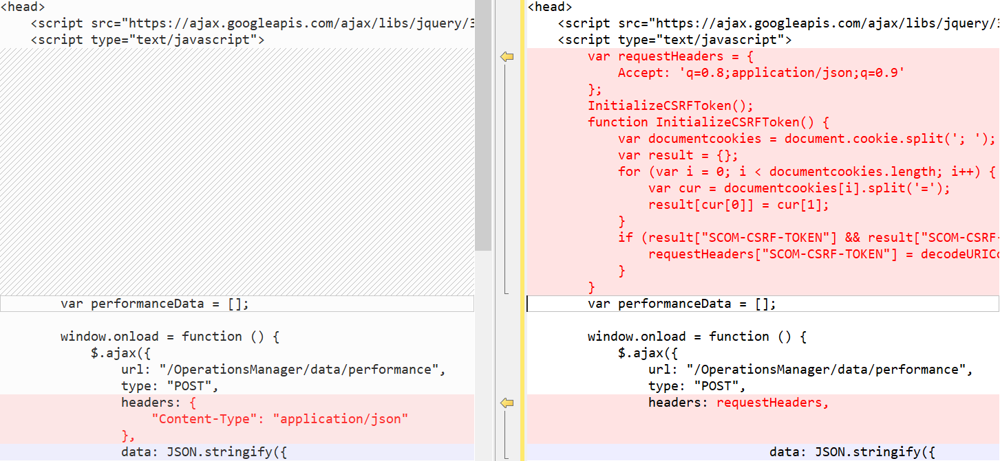

# Operations Manager REST API Reference

System Center Operations Manager provides flexible and cost-effective infrastructure monitoring that helps ensure predictable performance and availability of critical applications and infrastructure services. Operations Manager offers comprehensive monitoring for your datacenter by checking the health, performance, and availability of all monitored objects in your environment, and helping to identify problems for rapid resolution. For a more detailed overview, see the System Center Operations Manager [product page](https://docs.microsoft.com/system-center/scom/).

> ![NOTE]
> Operations Manager 2019 UR1 supports Cross-Site Request Forgery (CSRF) tokens to prevent CSRF attacks. If you are using Operations manager 2019 UR1, you must initialize the CSRF token. HTML scripts do not work if the CSRF tokens are not initialized.

## Initialize the CSRF token

Required action, applicable for Operations Manager 2019 UR1.

1. In the HTML header of the dashboard, add the following code:

```var requestHeaders = {
            Accept: 'q=0.8;application/json;q=0.9',
            "Content-Type": "application/json"
        };
        InitializeCSRFToken();
        function InitializeCSRFToken() {
            var documentcookies = document.cookie.split('; ');
            var result = {};
            for (var i = 0; i < documentcookies.length; i++) {
                var cur = documentcookies[i].split('=');
                result[cur[0]] = cur[1];
            }
            if (result["SCOM-CSRF-TOKEN"] && result["SCOM-CSRF-TOKEN"] != null) {
                requestHeaders["SCOM-CSRF-TOKEN"] = decodeURIComponent(result["SCOM-CSRF-TOKEN"]);
            }
        }
```

1. In the **onload** function, change the header value to **requestHeaders**.

**Example:**


